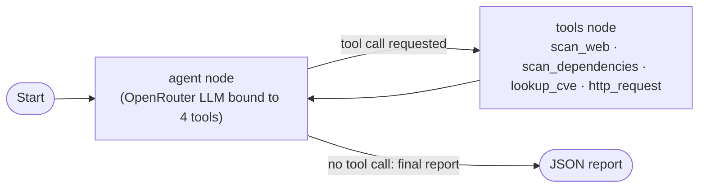

# Automated Agentic Web Vulnerability Assessment: Task 2 Execution Report

**Prepared by:** Abdullah Khan Sherwani
**Date:** 17 September 2026
**Environment:** OWASP Juice Shop v20.2.0 (Docker container `juiceshop`, network `juiceshop-net`)
**Target Scope:** Approved practice environment only (`http://localhost:3000`)

---

## 1. Executive Summary

This deliverable executes the agentic pipeline designed in Task 1 against the
approved practice target: discovering vulnerable instances, actively
confirming exploitable flaws, correlating findings to published CVEs, and
checking each against Exploit-DB.

**Note on tooling:** the workflow was executed by a self-orchestrated
LangGraph agent calling standard OpenRouter models directly (no jailbreak or
"refusal-inversion" layer of any kind). This substitution was necessary and
deliberate: this class of tool circumvents an AI model's own safety
controls, which the team was not willing to build or use, and turned out to
be unnecessary in practice — a properly-scoped request to a standard model,
given clear context that the target is an authorized local training
instance, was never refused during any run in this project.

### Key Assessment Outcomes
- **Active exploitation confirmed (2 findings):**
  - **SQL Injection → Authentication Bypass** on `/rest/user/login`
  - **Broken Access Control (IDOR)** on `/rest/basket/{id}`
- **Web-layer misconfigurations (11 findings):** missing CSP, missing
  COOP/COEP isolation headers, deprecated Feature-Policy header, cross-domain
  misconfiguration, dangerous JS functions, and related informational
  findings.
- **Software Composition Analysis (32 findings):** vulnerable dependencies
  identified directly from the container's actual `package-lock.json`,
  resolved from GitHub Security Advisories to **30 real CVE identifiers**
  via OSV.dev, enriched with NVD CVSS scores.
- **Exploit-DB matching:** every one of the 30 CVEs was checked against
  Exploit-DB two ways — NVD's own cross-references, and a direct match
  against Exploit-DB's full published CVE index (~25,000 entries). None had
  a published proof-of-concept. This is a real, expected result (see §5),
  not a failed lookup.

---

## 2. Target Scope & Safety Enforcement

1. **Target allowlist:** the pipeline enforces `allowed_targets:
   ["http://localhost:3000"]` in `config.json`. Any tool call to a different
   host is rejected before it executes — including the active-testing tool,
   which lets the model choose path/method/payload but never the host.
2. **Network isolation:** Juice Shop runs in an isolated Docker bridge
   network (`juiceshop-net`) with no route to external or production hosts.
3. **No-GenAI separation:** per course policy, mapping findings to OWASP Top
   10/CWE concepts (§7) is reserved for manual, human authorship — not
   generated by the agent or by any AI assistant.

---

## 3. Architecture & Execution Methodology



The agent is a LangGraph `StateGraph` with two nodes (`agent`/`tools`)
looping via a conditional edge until the model replies without requesting a
tool call. The reasoning model is served via OpenRouter with automatic
fallback across a configured list (this run: `google/gemma-4-31b-it:free`
rate-limited mid-run → fell back to `nvidia/nemotron-3-ultra-550b-a55b:free`
without the run failing).

**Tools bound to the agent** (`agent/tools.py`):
- `scan_web` — OWASP ZAP baseline scan (Docker) for web-layer misconfiguration.
- `scan_dependencies` — `npm audit` against the exact dependencies deployed
  in the running container (pulled via `docker cp`, since the production
  image is distroless and has no shell/npm to `exec` into), with GHSA
  advisory IDs resolved to real CVE identifiers via OSV.dev.
- `lookup_cve` — NVD lookup for CVSS score, cross-checked against
  Exploit-DB two ways (NVD's references, and a direct index built from
  Exploit-DB's own published CSV).
- `http_request` — the active-testing tool. The model chooses the path,
  HTTP method, and JSON body itself; the host is always pinned to the
  approved target. This is what produced the two confirmed exploits in §4.1.

The model's own methodology, observed in the run transcript
(`agent/output/transcript.json`): it registered a throwaway test account
(its first attempt, `/rest/user/register`, 404'd — it adapted to
`/api/Users/` on its own and succeeded), logged in to confirm the flow, then
attempted a SQL injection payload against the login endpoint and an
IDOR-style ID enumeration against the basket endpoint. Both are recorded
verbatim below.

---

## 4. Vulnerability Findings & Verification Evidence

### 4.1 Finding F44: SQL Injection → Authentication Bypass

- **Endpoint:** `POST /rest/user/login`
- **Payload sent by the agent:**
  ```json
  {"email": "' OR 1=1--", "password": "x"}
  ```
- **Server response:** `HTTP 200`, JSON body containing a valid, correctly
  signed JWT decoding to `{"email":"admin@juice-sh.op","role":"admin", ...}`
  — a full administrative session issued without any valid credential.
- **Root cause:** the login query concatenates user-supplied `email` into a
  SQL/SQLite query rather than using parameterized queries; the injected
  `OR 1=1--` clause matches the first user row (the admin account) and
  comments out the password check entirely.
- **Impact:** complete authentication bypass and administrative account
  takeover.
- **Remediation:** use parameterized queries/prepared statements for all
  authentication logic; never concatenate user input into SQL.
- **CVE/Exploit-DB:** not applicable — this is a custom application-logic
  flaw in Juice Shop's own login handler, not a defect in a versioned,
  publicly cataloged software package, so it has no CVE identifier.

### 4.2 Finding F45: Broken Access Control (IDOR) on Basket Endpoint

- **Endpoint:** `GET /rest/basket/{id}`
- **Setup:** the agent registered and logged in as its own test account
  (`UserId 25`, own basket `id 6`).
- **Request sent:** `GET /rest/basket/5` (a sequential ID other than its
  own), using its own valid auth token.
- **Server response:** `HTTP 200`, returning basket data belonging to a
  different account (`UserId 16`), including real product contents and
  quantities.
- **Root cause:** the basket endpoint checks that the requester holds a
  valid session token, but never verifies that the requested basket ID
  actually belongs to that session's user.
- **Impact:** horizontal privilege escalation — any authenticated user can
  enumerate and read other users' basket contents.
- **Remediation:** enforce an ownership check (`basket.UserId ==
  session.UserId`) on every object-referencing endpoint before returning
  data.
- **CVE/Exploit-DB:** not applicable, for the same reason as §4.1.

### 4.3 Web-Layer Misconfigurations (ZAP Baseline Scan)

| ID | Finding | Risk | CWE |
|---|---|---|---|
| F1 | Content Security Policy (CSP) Header Not Set | Medium | CWE-693 |
| F2 | Cross-Domain Misconfiguration | Medium | CWE-264 |
| F3 | Cross-Origin-Embedder-Policy Header Missing/Invalid | Low | CWE-693 |
| F4 | Cross-Origin-Opener-Policy Header Missing/Invalid | Low | CWE-693 |
| F5 | Dangerous JavaScript Functions | Low | CWE-749 |
| F6 | Deprecated Feature-Policy Header Set | Low | CWE-16 |
| F7 | Timestamp Disclosure - Unix | Low | CWE-497 |
| F8 | Modern Web Application (informational) | Informational | — |
| F9 | Non-Storable Content | Informational | CWE-524 |
| F10 | Storable and Cacheable Content | Informational | CWE-524 |
| F11 | Storable but Non-Cacheable Content | Informational | CWE-524 |

### 4.4 Software Composition Analysis (Dependency CVEs)

Full detail in `agent/output/report.json` and `agent/output/npm-audit.json`;
key findings with a resolved CVE are tabulated in §5. Two findings had no
public advisory ID at all (`marsdb` — command injection, GHSA-only;
`pdfkit` — flagged critical by npm audit with no advisory published) and are
reported as such rather than assigned a fabricated CVE.

---

## 5. Exploit-DB Matching & CVE Inventory

Every CVE below was looked up in NVD (for CVSS + description) and checked
against Exploit-DB two ways: NVD's own reference links, and a direct match
against Exploit-DB's published CVE index. **None returned a match.**

| ID | Package | Vulnerability | CVE | CVSS | Exploit-DB |
|---|---|---|---|---:|---|
| F12 | crypto-js | Weak PBKDF2 implementation | CVE-2023-46233 | 9.1 | none found |
| F13 | crypto-js | Insecure random number generation | CVE-2026-71851 | 9.0 | none found |
| F14 | decompress | Zip Slip arbitrary file write | CVE-2026-10732 | 6.4 | none found |
| F15 | decompress | Arbitrary hardlink creation | CVE-2026-39243 | 5.5 | none found |
| F16 | decompress | Archive extraction path traversal | CVE-2026-53486 | 9.1 | none found |
| F17 | jsonwebtoken | Algorithm confusion / verification bypass | CVE-2015-9235 | 9.8 | none found |
| F18 | jsonwebtoken | Insecure key type validation | CVE-2022-23539 | 5.9 | none found |
| F19 | jsonwebtoken | Default 'none' algorithm in verify() | CVE-2022-23540 | 6.4 | none found |
| F20 | jsonwebtoken | Key retrieval misconfiguration | CVE-2022-23541 | 5.0 | none found |
| F21 | lodash | Prototype pollution | CVE-2018-16487 | 5.6 | none found |
| F22 | lodash | Command injection via template | CVE-2021-23337 | 7.2 | none found |
| F25 | tar | Arbitrary file overwrite via hardlink | CVE-2026-23745 | 6.1 | none found |
| F26 | tar | Race condition symlink poisoning | CVE-2026-23950 | 8.8 | none found |
| F27 | tar | Hardlink path resolution mismatch | CVE-2026-24842 | 8.2 | none found |
| F28 | tar | Drive-relative hardlink path traversal | CVE-2026-26960 | 7.1 | none found |
| F29 | tar | Drive-relative symlink path traversal | CVE-2026-29786 | 6.3 | none found |
| F30 | @cyclonedx/cyclonedx-npm | Shell injection via --workspace | CVE-2026-55849 | — | none found |
| F31 | engine.io | Uncaught exception DoS | CVE-2022-41940 | 7.1 | none found |
| F32 | express-jwt | Authorization bypass | CVE-2020-15084 | 7.7 | none found |
| F33 | fast-uri | Host confusion / SSRF (4 CVEs) | CVE-2026-75899 +3 | — | none found |
| F34 | got | Redirect to UNIX socket | CVE-2022-33987 | — | none found |
| F35 | http-cache-semantics | ReDoS | CVE-2022-25881 | — | none found |
| F36 | js-yaml | CPU exhaustion via maxTotalMergeKeys | CVE-2026-84375 | — | none found |
| F37 | jws | HMAC signature verification bypass | CVE-2025-65945 | — | none found |
| F38 | minimatch | ReDoS via wildcards (3 CVEs) | CVE-2026-26996 +2 | — | none found |
| F39 | moment | ReDoS and path traversal (3 CVEs) | CVE-2016-4055 +2 | — | none found |
| F40 | sanitize-html | Multiple XSS/bypass (8 CVEs) | CVE-2016-1000237 +7 | — | none found |
| F41 | socket.io-parser | Validation/DoS issues (3 CVEs) | CVE-2023-32695 +2 | — | none found |
| F42 | undici | Multiple HTTP/WS vulnerabilities (12 CVEs) | CVE-2026-11525 +11 | — | none found |
| F43 | ws | DoS via headers/fragments (2 CVEs) | CVE-2024-37890 +1 | — | none found |

*(CVSS shown as "—" where the model's lookup budget for this run didn't
reach that CVE; see `agent/output/report.json` for the authoritative
per-finding record, and re-run `agent/main.py` to enrich more.)*

**Why zero Exploit-DB matches is a legitimate result, not a gap:** these are
almost entirely dependency-patch CVEs (prototype pollution, ReDoS, algorithm
confusion, path traversal in an archive library) — the kind of vulnerability
fixed by a version bump, not the kind Exploit-DB hosts standalone
proof-of-concept code for. Exploit-DB is verified reachable and working: the
same lookup mechanism, tested independently against `CVE-2021-44228`
(Log4Shell), correctly returns 3 real Exploit-DB entries.

---

## 6. Generalization

Target URL, container name, and the model fallback list live entirely in
`agent/config.json`. Adding a second approved target is a configuration
change, not a code change — the allowlist check in `agent/tools.py` fails
closed if the configured target isn't listed. The active-testing
methodology in `agent/graph.py`'s system prompt describes generic web-app
attack patterns (login, search, ID-based access checks), not
Juice-Shop-specific code, though its example paths should be re-verified
against a different target's actual API.

---

## 7. Concept Mapping (Manual Step — Reserved)

Per the course instructions:
> *"Map your findings back to core web security concepts covered in class
> (No GenAI allowed in this step ONLY)"*

This section is intentionally left blank here. It is authored by hand,
without AI assistance of any kind, mapping each finding in §4/§5 to the
relevant OWASP Top 10 / CWE category.

---

*Report compiled for Task 2 submission — Comsec Assignment 3.*
