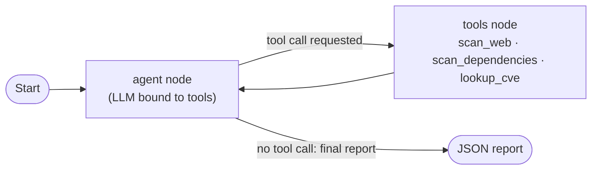

# Scutum AI

**An agentic vulnerability-assessment pipeline.** An LLM agent, built on
LangGraph, autonomously scans an intentionally-vulnerable local web target,
correlates what it finds to real published CVEs, and produces a structured
report — with no fixed, hand-scripted sequence of steps.


## Overview

Scutum AI targets [OWASP Juice Shop](https://owasp.org/www-project-juice-shop/),
an intentionally vulnerable web application, and runs a security assessment
end to end without manual, step-by-step operator intervention:

1. **Discovers** web-layer issues with an OWASP ZAP baseline scan and
   dependency vulnerabilities with `npm audit` against the exact packages
   installed in the running container.
2. **Correlates** every finding to a real CVE where one exists — resolving
   GitHub Security Advisory IDs to CVE identifiers via OSV.dev, then
   enriching high-severity CVEs with CVSS scores and Exploit-DB references
   from the NVD.
3. **Reports** a structured JSON of findings: title, evidence, CVE, CVSS,
   Exploit-DB link (if any), and remediation.

The agent — not a fixed script — decides which tool to call, in what order,
and when it has gathered enough evidence to stop. That decision loop is what
makes this agentic rather than a scripted pipeline with an LLM bolted on.

## How it works



This is a [LangGraph](https://github.com/langchain-ai/langgraph) `StateGraph`
with two nodes. The `agent` node calls an LLM (via OpenRouter's free tier,
with automatic fallback across a list of models if one is rate-limited or
deprecated). If the model's reply requests a tool call, control passes to the
`tools` node, which executes it and loops back. Once the model replies with
plain text instead of a tool call, that's the final report and the graph
ends. Run state persists via a LangGraph checkpointer, so a run can be
inspected or resumed rather than existing only for the lifetime of the
process.

## Features

- **Agentic control flow** — the model chooses the next action; the graph
  doesn't hardcode a scan order.
- **Real CVE correlation, not guesswork** — `npm audit` only returns GHSA
  IDs, not CVE numbers, so this pipeline resolves them via OSV.dev rather
  than relying on the model already knowing a CVE number from training.
- **Model-fallback chain** — free-tier LLM availability on OpenRouter shifts
  often; the agent rotates to the next configured model on a rate limit or a
  deprecated model ID instead of failing the run.
- **Scope enforcement by construction** — every tool acts only on the target
  defined in `config.json`; none of them accept a model-supplied URL or
  container name, so the agent cannot be steered outside the approved scope.
- **Config-driven, not hardcoded** — adding a new approved target is a
  config change, not a code change.

## Quickstart

Prerequisites: Docker Desktop running, Python 3, and a free
[OpenRouter](https://openrouter.ai/keys) API key.

```bash
cd agent
pip install -r requirements.txt
cp .env.example .env   # add your OPENROUTER_API_KEY
python main.py
```

Full setup details, configuration fields, and output layout are documented
in [`agent/README.md`](agent/README.md).

## Project structure

```
.
├── agent/                    # the pipeline itself
│   ├── tools.py               # scan_web, scan_dependencies, lookup_cve
│   ├── graph.py                # the LangGraph StateGraph + system prompt
│   ├── main.py                  # entry point
│   ├── config.json               # target, allowlist, model list
│   └── README.md                  # setup/run instructions
├── Plan/
│   └── Task1_Workflow_Design.md  # original workflow design write-up
└── CLAUDE.md                  # coding guidelines for this repo (recursive
                                # per-folder CLAUDE.md files under agent/, Plan/)
```

## Scope and safety

This project only ever targets a local, intentionally-vulnerable practice
instance (OWASP Juice Shop) running in an isolated Docker network. The
target allowlist is enforced in code, not just documented as policy — any
target not on the list is rejected before a tool runs. This is a coursework
project; it is not intended or designed for use against real or production
systems.

## Known limitations

- **Exploit-DB matching can legitimately return nothing.** Many dependency
  CVEs (prototype pollution, algorithm confusion, ReDoS) are fixed by a
  version bump and never get a standalone proof-of-concept on Exploit-DB.
  An empty `exploit_db` field means none was found in the CVE's NVD
  references, not a broken lookup.
- **Free-tier LLM availability drifts.** Model IDs on OpenRouter get
  deprecated or rate-limited without notice; `config.json`'s
  `openrouter_models` list should be checked against
  `GET https://openrouter.ai/api/v1/models` if a run fails outright.
- **OWASP Top 10 / CWE concept-mapping is intentionally out of scope for the
  agent** — it's a manual, no-GenAI step performed separately.
